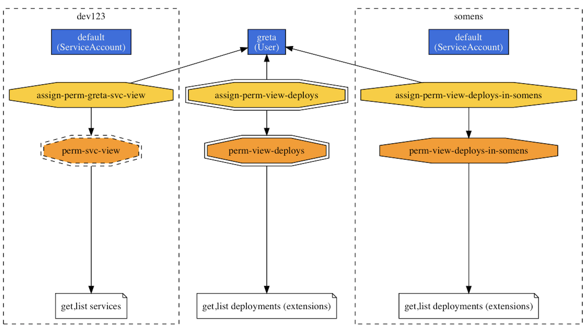

The RBAC permissions form a graph: users and service accounts as the entities (or: actors) who want to carry out certain tasks, (cluster) roles stating the allowed actions (think: policies), and (cluster) role bindings that assign (cluster) roles to entities, effectively permitting them to do certain things to certain resources. Since there are many moving parts and connections between them, visualizing them is a good way to get an overview what is going on in the cluster from a permissions point-of-view and also to understand who's allowed to do what.

## Graph

!!! info
    The following example assumes you're using macOS.

If you have [rback](https://github.com/team-soteria/rback) and [Graphviz](https://www.graphviz.org/) installed, you can generate a permissions graph like so:

```sh
kubectl get sa,roles,rolebindings,clusterroles,clusterrolebindings \
        --all-namespaces -o json | \
        rback | \
        dot -Tpng > /tmp/rback.png && \
        open /tmp/rback.png
```

Resulting in something like the following permissions graph (and note that only a small part is shown here):



## Matrix

Available as `krew` [plugins](https://github.com/kubernetes-sigs/krew-index/blob/master/plugins.md):

```sh
kubectl access-matrix --as greta -n somens

kubectl rbac-view
```